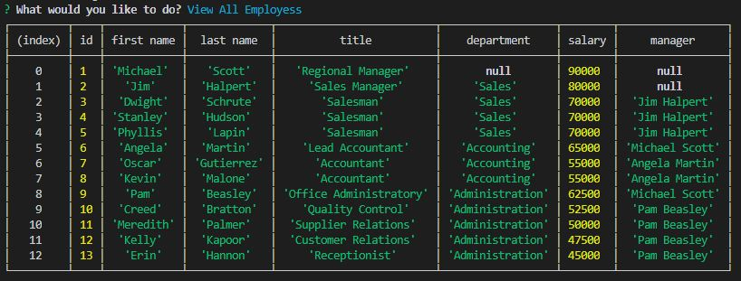
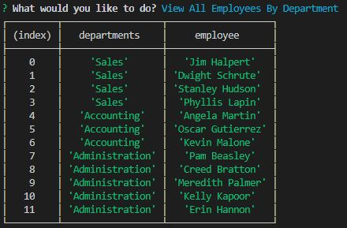
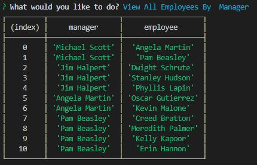
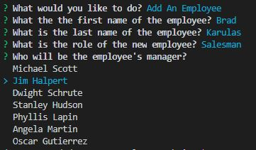
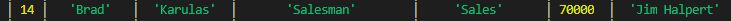
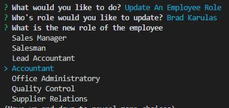
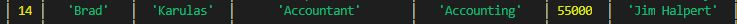
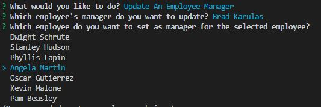
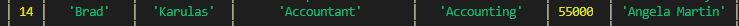
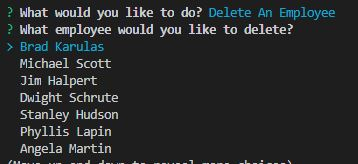

# Employee-Tracker
##Unit 12 Assignment

In this assignment I created a functional database for a work environment. Once the tables were created and populated you are able to preform the following functions:

  * View all employees in the company:

  * View all employees in a department:

  * View all employees and their manager:

  * You can add a new employee:

  * Change the role of any employee:

  * Change the manager of any employee:

  * And finally delete an employee:

##

#Links:
 * GitHub: https://github.com/bkarulas/Employee-Tracker